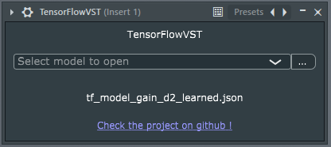

# TensorFlowVST
TensorFlowVST is a VST3 audio plugin that allows you to use TensorFlow (Keras) models as VST effects.

# Downloads [TensorFlowVST 1.0](https://github.com/Cyril-Meyer/TensorFlowVST/releases/tag/1.0)

# Example audio results:

https://user-images.githubusercontent.com/69190238/132956776-8c92a0ef-4aa1-4ee8-a4f2-0a4348c4bddd.mov

https://user-images.githubusercontent.com/69190238/132956778-16ed5ee7-9435-42ec-ae02-6f82ad3c4b06.mov

https://user-images.githubusercontent.com/69190238/132956779-f2dbfdd8-609c-4408-a17f-cf41a7200d66.mov

https://user-images.githubusercontent.com/69190238/132956780-d0ffd33a-cc69-4269-aa1f-7aacc7fbc4d5.mov

https://user-images.githubusercontent.com/69190238/132956781-7ba7472d-1d1d-4a44-b76d-47d9c24e0a7f.mov

# Acknowledgement

Special thanks to [Image-Line](https://www.image-line.com/) which allows us to always test our plugins on the latest FL Studio.

Also thanks to [Juce](https://juce.com/) which provide a free and open-source audio plugin framework.

