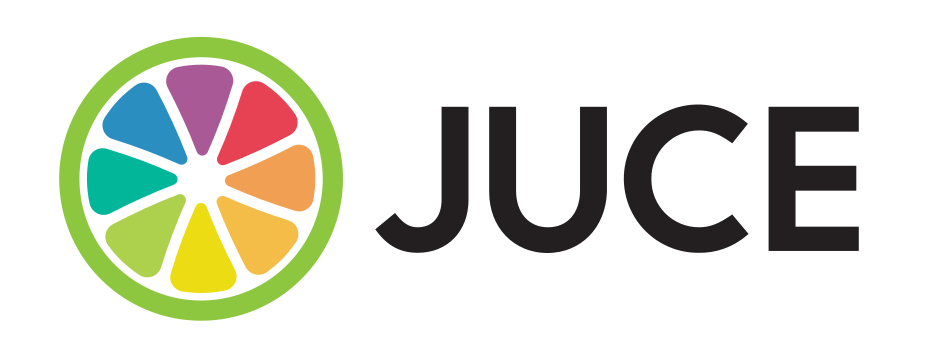

# TensorFlowVST

# Acknowledgement

Special thanks to [Image-Line](https://www.image-line.com/) which allows us to always test our plugins on the latest FL Studio.

Also thanks to [Juce](https://juce.com/) which provide a free and open-source audio plugin framework.

